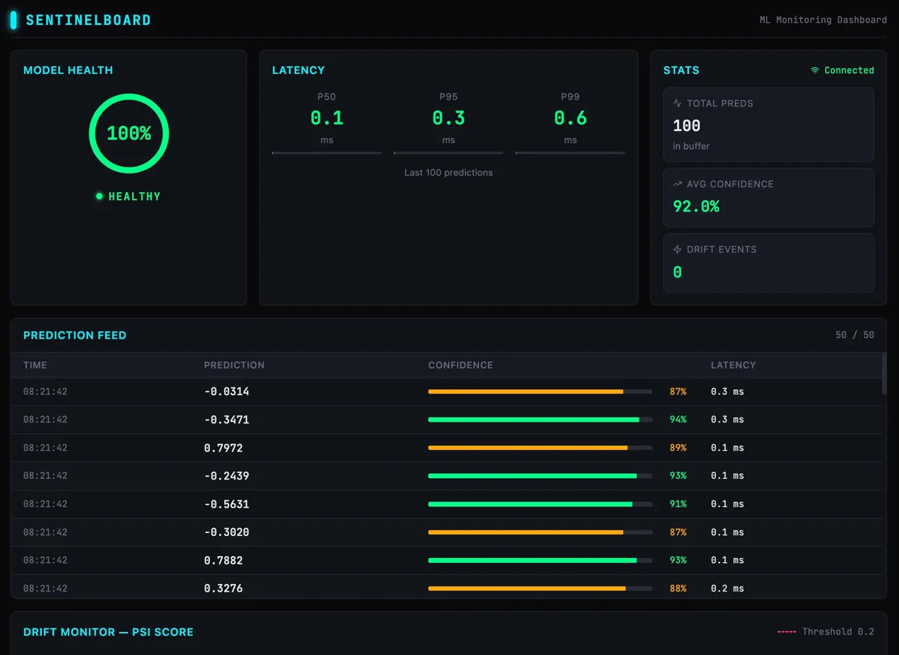
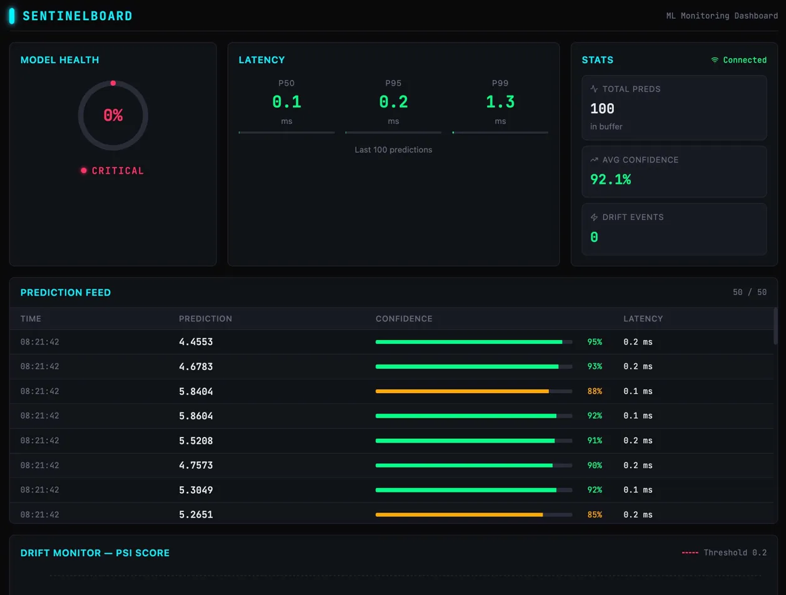

# SentinelBoard

Real-time ML model monitoring with drift detection, WebSocket prediction streaming, and Prometheus observability.

**Live ML Model Monitoring Dashboard** — real-time prediction feed, drift detection, and observability.


## Live Deployment

Deployed on AWS EC2 (t3.micro, Ubuntu 24.04) via Docker Compose.


**Live URL:** http://13.218.118.77:3000 (start EC2 instance to activate)

## Demo

**[Live Dashboard →](https://sentinelboard-ui.onrender.com)** · **[API Docs →](https://sentinelboard-api.onrender.com/docs)**

| Normal Operation | Drift Detected |
|:---:|:---:|
|  |  |

## Architecture

```
┌──────────────────┐      WebSocket       ┌──────────────────┐
│   React Frontend │◄────────────────────►│  FastAPI Backend │
│   (Recharts, WS) │                      │  (Model Serving) │
└──────────────────┘                      └────────┬─────────┘
                                                   │
                                          ┌────────▼─────────┐
                                          │   Prometheus     │
                                          │   (Metrics)      │
                                          └────────┬─────────┘
                                                   │
                                          ┌────────▼─────────┐
                                          │   Grafana        │
                                          │   (Dashboards)   │
                                          └──────────────────┘
```

## Features

- **Real-time prediction feed** via WebSocket
- **PSI-based drift detection** with configurable thresholds
- **KS-test** secondary validation
- **Prometheus metrics**: predictions/sec, latency histogram (p50/p95/p99), drift scores
- **Grafana dashboards**: pre-built panels for model monitoring
- **Auto-deploy**: GitHub Actions → Render on push to main

## Drift Detection

SentinelBoard uses **Population Stability Index (PSI)** as the primary drift signal, with a configurable threshold (default `0.2`). PSI is computed over a rolling window of 200 observations against a reference distribution captured at training time.

- **PSI threshold**: configurable via `SB_DRIFT_PSI_THRESHOLD` (default `0.2`). Values below `0.1` indicate stable distribution; above `0.2` indicate significant drift.
- **KS-test**: runs as secondary validation per feature, providing a p-value alongside the PSI score.
- **Real-time alerts**: when PSI exceeds the threshold, a `drift_detected: true` flag is broadcast over WebSocket to all connected clients instantly.
- **Traffic scripts**: use `simulate_traffic.py` to generate normal load and `inject_drift.py` to shift the input distribution and trigger alerts.

## Quick Start

```bash
# Backend
cd backend
python -m venv venv && source venv/bin/activate
pip install -r requirements.txt
uvicorn app.main:app --reload

# Frontend
cd frontend
npm install && npm run dev

# Full stack (Docker)
cd infra && docker compose up
```

## API

| Endpoint | Method | Description |
|----------|--------|-------------|
| `/health` | GET | Health check with model + drift status |
| `/predict` | POST | Run prediction, returns result + broadcasts via WS |
| `/metrics` | GET | Prometheus metrics |
| `/drift/history` | GET | PSI score history |
| `/ws` | WS | Real-time prediction + drift alert stream |

## Testing

```bash
cd backend && pytest --cov=app
```

## Scripts

```bash
python scripts/simulate_traffic.py --rate 10 --duration 60
python scripts/inject_drift.py --shift 0.1 --duration 120
```

## Tech Stack

**Backend**: Python, FastAPI, WebSockets, Prometheus, scikit-learn, NumPy, SciPy
**Frontend**: React, TypeScript, Recharts, Tailwind CSS, Vite
**Infrastructure**: Docker, Prometheus, Grafana, GitHub Actions, Render

## License

MIT
